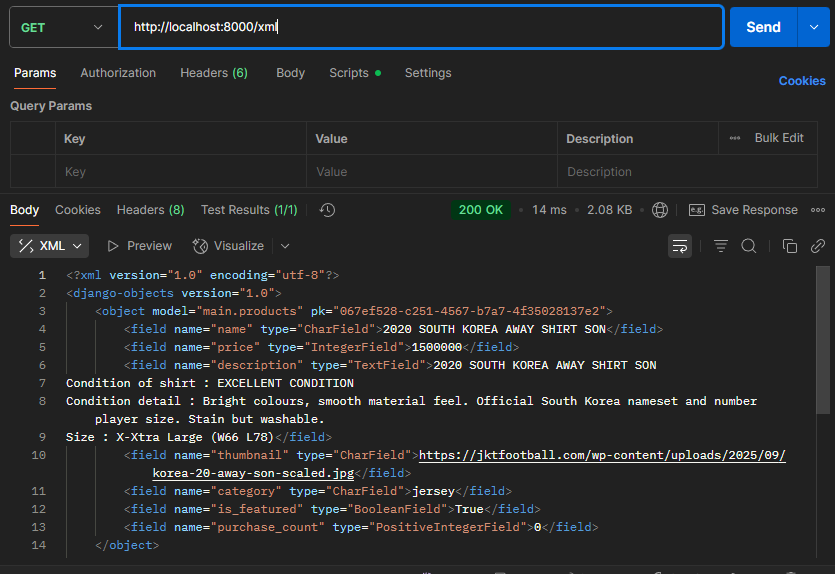

Tautan Aplikasi PWS: [https://maira-azma-footballshop.pbp.cs.ui.ac.id/](https://maira-azma-footballshop.pbp.cs.ui.ac.id/)

# TUGAS 2

**1. Jelaskan bagaimana cara kamu mengimplementasikan checklist di atas secara step-by-step (bukan hanya sekadar mengikuti tutorial).**  
Pertama-tama, saya membaca checklist sampai habis, untuk melihat requirement apa yang dibutuhkan sebelum saya memulai. Kemudian, saya melakukan simplifikasi (karena saya melihat ada beberapa step pada tutorial yang tidak perlu dilakukan, contohnya push bisa dilakukan di akhir saja). Pada pengerjaan ini, saya learning by doing. Pada tutorial 0 dan 1, ada beberapa step yang memang sudah saya pahami. Namun, untuk step-step yang belum terlalu saya pahami, saya bertanya kepada teman saya atau mengonfirmasi pemahaman saya dengan bertanya kepada ChatGPT. 

**2. Buatlah bagan yang berisi request client ke web aplikasi berbasis Django beserta responnya dan jelaskan pada bagan tersebut kaitan antara urls.py, views.py, models.py, dan berkas html.**  

Ketika request client diterima, urls.py akan langsung dijalankan untuk memastikan bahwa url yang ingin diakses client tersedia. Ketika url valid, maka akan dipanggil fungsi pada views.py sesuai url masing-masing. Pada views.py, dipastikan terlebih dahulu bahwa client memang memiliki hak akses untuk url tersebut. Jika client sudah punya izin akses, dapat dilakukan pengambilan database, dan pemilihan tampilan. Setiap halaman memiliki tampilannya masing-masing, views.py membantu kita memilah berbagai template untuk berbagai halaman. Ketika data sudah siap, barulah dilakukan query pada models.py. Selanjutnya, begitu tampilan sudah disesuaikan dan data-data yang akan ditampilkan sudah diproses, Django akan menyesuaikan kedua hal itu sesuai file html pada folder 'templates'. Terakhir, barulah halaman bisa ditampilkan kepada client (Response).

**3. Jelaskan peran settings.py dalam proyek Django!**  
Sesuai namanya, settings.py dalam proyek Django memiliki peran sebagai pengaturan utama proyek secara keseluruhan. File tersebut menyimpan environment yang perlu di-install sebelum proyek dijalankan, hal ini untuk memastikan bahwa semua yang mengakses aplikasi tersebut dapat menjalankan semua fitur dengan baik. Pengaturan keamanan juga dikelola di sini, siapa saja yang dapat mengakses, apa saja yang dapat diakses, dan lain-lain. Jadi, settings.py adalah pengaturan, dengan cara apa, seperti apa, dan menggunakan apa aplikasi akan berjalan. 

**4. Bagaimana cara kerja migrasi database di Django?**  
Pertama-tama, ketika file models.py berubah, kita perlu memberitahu sistem bahwa kita melakukan perubahan dengan command 'python manage.py makemigrations'. Kemudian sistem akan mendefinisikan perubahan tersebut. Selanjutnya, ketika command 'python manage.py migrate' dijalankan, sistem barulah membaca pendefinisian perubahan tadi dan menerapkannya ke database. Jadi, perubahan model bisa berdampak pada perubahan database (mungkin dibuat fungsi baru, atau fungsi yang dirubah cara kerjanya). Maka dari itu, setiap melakukan perubahan pada model, kita perlu memastikan bahwa sistem telah memahami perubahan tersebut agar cara kerjanya sudah aman untuk diaplikasikan ke database.

**5. Menurut Anda, dari semua framework yang ada, mengapa framework Django dijadikan permulaan pembelajaran pengembangan perangkat lunak?**  
Menurut saya, struktur file Django yang terorganisir membuat saya lebih mudah memahami alur kerja sebuah web. Penamaan file yang representatif memudahkan developer untuk mengatur file jika nanti jumlahnya sudah banyak (misal sudah ada beberapa aplikasi). Selain itu, setelah saya telusuri lagi, setiap default code diberikan command yang mudah dipahami. Hal ini mendukung developer-developer baru untuk memahami fungsi file, bahkan tiap baris code yang ada pada file tersebut. 

**6. Apakah ada feedback untuk asisten dosen tutorial 1 yang telah kamu kerjakan sebelumnya?**  
Gak adaa, sudah jelas kok :D

# TUGAS 3

**1. Jelaskan mengapa kita memerlukan data delivery dalam pengimplementasian sebuah platform?**  
Data delivery merupakan sebuah sistem bagaimana data-data dikirim antara frontend, backend, external user, dll. Pada dasarnya, sebuah platform hanyalah wadah untuk memberikan data dengan cara yang lebih interaktif. Demikian data adalah pilar utama sebuah platform, cara kita memperlakukan data tersebut juga harus menjadi pertimbangan. Maka dari itu, data delivery menjadi aspek penting dalam pengimplementasian sebuah platform.

**2. Menurutmu, mana yang lebih baik antara XML dan JSON? Mengapa JSON lebih populer dibandingkan XML?**  
Saya lebih umum bekerja dengan JSON dibandingkan XML, maka menurut saya JSON lebih baik. Jika diperhatikan lagi, struktur JSON lebih mudah dipahami bagi orang-orang yang baru belajar mengenai struktur data karena bentuknya yang lebih mirip set pada bahasa python. Pada pengembangan platform, JSON lebih sering dipakai sebab dia juga merupakan pengembangan dari JavaScript. Kita tahu bahwa JavaScript sudah menjadi bahasa scripting yang sangat umum digunakan di kalangan para developer. Kerelevanan JavaScript dan JSON menjadi suatu kemudahan bagi developer untuk melakukan pengintegrasian data. Dengan demikian, saya rasa JSON masih lebih populer dari XML.

**3. Jelaskan fungsi dari method is_valid() pada form Django dan mengapa kita membutuhkan method tersebut**  
is_valid() pada form digunakan untuk memastikan bahwa input yang user berikan pada form sudah sesuai. Tiap form biasanya akan meminta data, data tersebut kemudian akan disimpan di database. Maka dari itu, sebelum disimpan, harus dipastikan bahwa data sudah sesuai (tipenya, batas karakternya, dll). Method is_valid() membantu kita untuk mengidentifikasi input, fungsi tersebut dapat memberikan error jika input tidak sesuai. Bila semua input sudah sesuai dengan database yang telah dideklarasikan pada models.py, data sudah bisa dimasukkan ke database.

**4. Mengapa kita membutuhkan csrf_token saat membuat form di Django? Apa yang dapat terjadi jika kita tidak menambahkan csrf_token pada form Django? Bagaimana hal tersebut dapat dimanfaatkan oleh penyerang?**  
csrf_token digunakan untuk meningkatkan keamanan platform. CSRF (Cross-Site Request Forgery) akan mencegah adanya pengiriman form dari cookie yang berbeda (ketika form dikirim dan ketika user login). Jadi ketika user mengawali sebuah sesi, sebuah token akan dibuat dan diberlakukan pada setiap POST. Maka, server hanya akan merespon jika token valid.

Jika tidak ada csrf_token, server tidak akan memastikan kembali cookie sesi dan menerima semua perintah yang di-request. Contoh, seorang penyerang login pada akun pengguna pada link A, kemudian penyerang tersebut mengakses suatu situs lain yang memungkinkannya untuk men-submit form pada link A. Jika tidak ada csrf_token, server akan menganggap form yang masuk adalah valid. Padahal, itu adalah usaha penyerang untuk melakukan submit form melalui situs luar.

**5. Jelaskan bagaimana cara kamu mengimplementasikan checklist di atas secara step-by-step (bukan hanya sekadar mengikuti tutorial).**  
Pertama-tama, saya membaca keseluruhan dokumen untuk memberikan gambaran apa saja yang perlu saya kerjakan. Ketika membaca, saya menyadari bahwa alurnya sedikit berbeda dengan tutorial, namun saya pikir step-by-step tidak terlalu penting karena nantinya semua file akan saling terhubung selama fungsinya berjalan. Saya mulai dengan menambahkan 4 fungsi baru di `views.py` untuk memungkinkan saya mengakses database dalam bentuk XML atau JSON, dan mencari data melalui id. Tidak lupa untuk menghubungkannya pada `urls.py` agar fungsi dapat berjalan dan diakses. Ada sedikit kendala ketika membuat page `create_product` dan `product_detail` karena saya sudah mencoba styling HTML sebelumnya. Beberapa penyesuaian saya lakukan, sekali-kali meminta ChatGPT untuk membantu saya. Masalah juga sedikit muncul ketika saya run server pertama kali karena penyesuaian dengn HTML tadi. *Trial and error* tersebut membuat saya lebih memahami alur web development.

**6. Apakah ada feedback untuk asdos di tutorial 2 yang sudah kalian kerjakan?**  
Seperti biasa sudah sangat jelassss.

## Screenshot Postman
### Screenshot akses ../json/

### Screenshot akses ../xml/

### Screenshot akses ../json/[id]

### Screenshot akses ../xml/[id]

# TUGAS 4

**1. Apa itu Django AuthenticationForm? Jelaskan juga kelebihan dan kekurangannya.**  
Django AuthenticationForm adalah suatu built-in class dari Django yang dapat membuat form untuk membuka akses bagi sebuah akun user untuk masuk ke suatu situs. Seperti sifat class pada umumnya, AuthenticationForm memiliki atribut `is_active()` berupa nilai boolean. Upaya login akan ditolak jika atribut ini bernilai `false`. Kelebihannya, karena class ini sudah dibuat oleh Django, fitur-fitur keamanan juga sudah ditangani, seperti serangan CSRF (Cross-Site Request Forgery). Sayangnya, karena class ini telah dibuat oleh Django, kustomisasi harus dilakukan secara manual oleh _developer_. Misal, pesan peringatan default perlu kita ubah sendiri pada HTML dan CSS, bagian layout form juga perlu kita kustomisasi manual karena Django hanya membuat sebuah template yang tidak menarik.

Source: [https://docs.djangoproject.com/en/5.2/topics/auth/default/](https://docs.djangoproject.com/en/5.2/topics/auth/default/)

**2. Apa perbedaan antara autentikasi dan otorisasi? Bagaiamana Django mengimplementasikan kedua konsep tersebut?**  
Autentikasi adalah untuk mengidentifikasi sebuah user, sedangkan otorisasi adalah proses memverifikasi akses-akses apa yang dimiliki sebuah user. Untuk melakukan proses autentikasi, Django membuat beberapa atribut seperti username, password, dan email yang membuat setiap user unik. Atribut-atribut ini akan membantu Django untuk mengidentifikasi user mana yang sedang aktif, yang sedang login, dll. Kemudian untuk proses otorisasi, Django membuat atribut permissions untuk objek user yang dapat dikustomisasi. Django juga menyediakan dekorator untuk fungsi pada `views.py`, contohnya `@login_required`.

**3. Apa saja kelebihan dan kekurangan session dan cookies dalam konteks menyimpan state di aplikasi web?**   
Session dapat menyimpan data sensitif pada lapisan server, seperti user_ID dan attribute sensitif. Namun, karena session disimpan di server, ada batasan session yang dapat ditampung oleh server. Sehingga jika sebuah server diperkirakan akan menyimpan banyak session (akan ada banyak user yang login pada satu waktu), perlu pertimbangan mengenai kapasitas server.

Sementara itu, cookie menyimpan data pada browser masing-masing pengguna. Sehingga tidak akan memberatkan server karena cookie ditanggung masing-masing pengguna. Hanya saja, karena cookie disimpan pada masing-masing pengguna, cookie akan bermasalah jika suatu pengguna misal tidak memiliki/menerima cookie tersebut.

**4. Apakah penggunaan cookies aman secara default dalam pengembangan web, atau apakah ada risiko potensial yang harus diwaspadai? Bagaimana Django menangani hal tersebut?**  
Cookie menjadi salah satu celah kelamanan suatu website karena disimpan di browser pengguna. Data yang disimpan menjadi rentan terhadap pencurian. Penyerang bisa mengakses cookie dan berpura-pura sebagai user tanpa izin user yang legal. Selain itu, pencurian cookie menjadi bahaya karena data-data yang disimpan bisa jadi diubah seenaknya.

**5. Jelaskan bagaimana cara kamu mengimplementasikan checklist di atas secara step-by-step (bukan hanya sekadar mengikuti tutorial).**  
Pertama-tama, saya membaca keseluruhan dokumen untuk memberikan gambaran apa saja yang perlu saya kerjakan. Seperti biasa, step-by-step pada tutorial sebetulnya dapat dijalankan tanpa memerhatikan urutan. Saya mengawali pengerjaan dengan membuat fitur register, login, dan logout, diikuti dengan penyesuaian  template, `views.py`, dan `urls.py`. Setelah itu, barulah saya menghubungkan user dengan objek Product. Begitu semua yang penting sudah dilakukan, saya melanjutkan dengan penyesuaian CSS mengikuti `base.html` yang telah saya rancang sebelumnya. 
